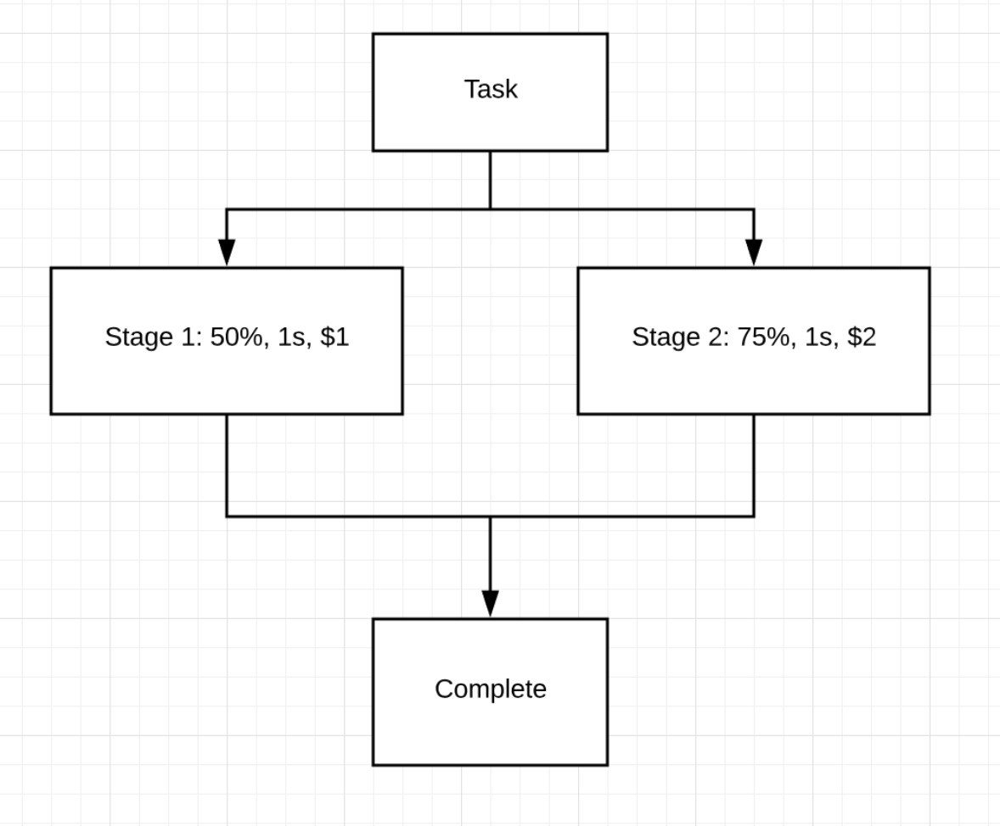

# SLA optimization strategy

## Introduction

I tried couple examples and concluded some typical scenarios for SLA optimization. I hope to define the principle of SLA first, then it will be easy to implement.

In SLA, we need to consider success rate, time cost, incentive cost (money). Success rate and time cost will be based on the historical data. Particularly, they may change according to different location and device. Incentive cost is very complicated to calculate. It might be reverse acution. In this article, I only give an arbitrary price, and we can discuss later. 

To optimize the execution flow, we need to not only calculate the possibility distribution of the task, but also balance the success rate, time cost and incentive cost by assigning number tasks to participants. Before optimization, we need to define a thredhold for the success rate. Here I assume the threshold of the overall success rate is 80%. 

Then I will use some examples to explain.

## Scenarios

### Scenario 1: Linear Flow

Linear flow is simply consective tasks without any fork. 

#### Success rate
Assume the theshold is 80%. For this task, if we only assign one person for each stage, the overall success rate will be only 75% * 50% = 37.5%, with time cost 3s and incentive cost $3. Therefore, we need to assign tasks to more people to increase the success rate. 

To satisfy the threshold, we must guarentee that the success rate of every stage must be higher than the threshold. Think about the example. If the threshold is 80%, then the greatest difference between success rate of two stages are 80% and 100%. Otherwise one will exceed 100%. However, the success rate of a single stage is decrease progresively. It is impossible to reach 100%. 

The formula used to decided the number needed is N = ceilling(ln(1 - T)/ln(1 - S)), where T is the threshold and S is the success rate. In this case, the stage 1 requries 3 people and stage 2 requires 2 people.

#### Cost 
If the overall success rate is still lower than the threshold after using the formula, then pick the one stage with the lowest cost to increase. I plan to use a list to compare the ratio of success rate and cost on every stage. Then iteratly add person util it reaches the threshold.

#### Time
In this scenario we don't need to consider time.

### Scenario 2: Alternative Flow

Alternative flow is a task that retrive data from multiply source. If one of these stages succeed, all other parallel tasks will stop. 

#### Success rate
For this task, if we only assign one person for each stage, the overall success rate will be 100 - (100 - 50) * (100 - 75)% = 87.5%.
